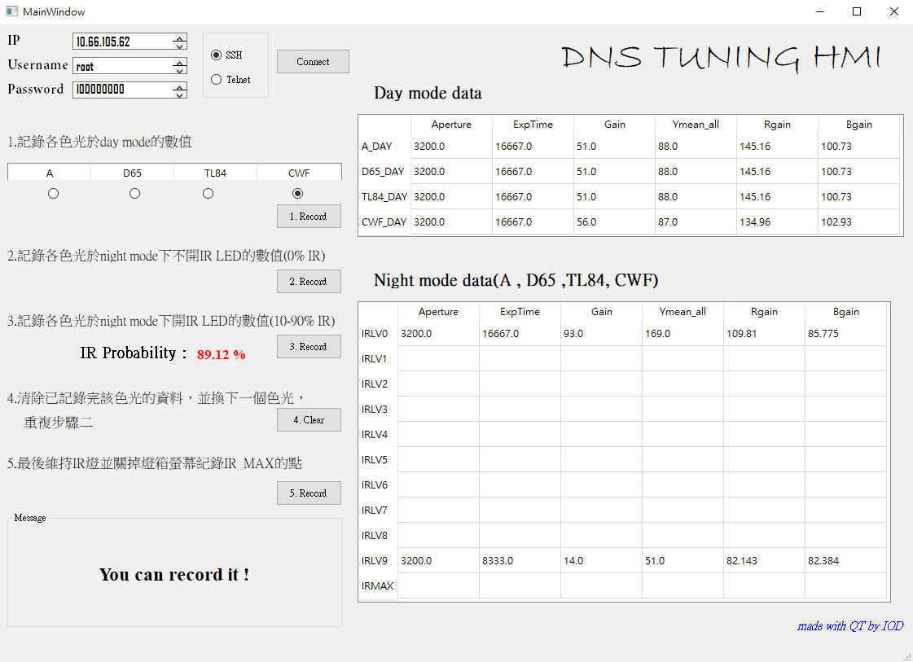

# DNS_Tuning_Tool
A HMI tool which improve the efficiency  of dns tuning flow
*dns is day night switch function

###### **Enviromnet building**
1. Download git and clone the file  
        `git clone http://ginga.vivotek.tw:3000/hank.lee/DNS-AUTOTUNING-TOOL.git`
2. Download python 3.6 https://www.python.org/downloads/windows/
3. Add enviroment valuables for python.exe
4. Go to cmd 
        `pip install -r requirements.txt`
5. Go to Image-Debug-Tool file and run the tool
        `python main_final.py`

###### **There is this tool's basic function**

Detail will show in the DNS_Tuning_Guide_V3.0.doc which is the inspection of DNS tuning flow

 
